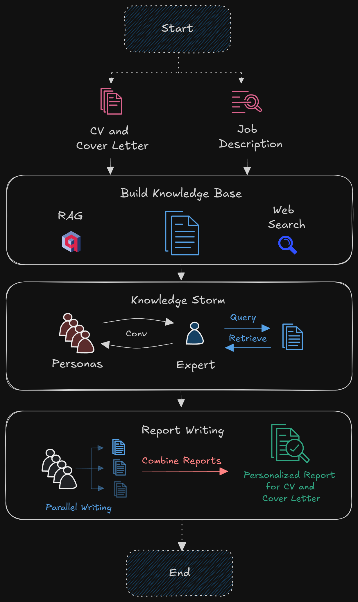

# Ghost Writer
Orchestrating LLM Personas to provide personalized CV suggestions


## Overview
Ghost Writer is a multi-persona AI Workflow that can drastically improve your job application strategy. It provides personalized reports on how to improve your CV and Cover Letter for any job role. It uses web search and autonomous information seeking conversations to tailor the reports for your documents.


## Key Features
- Inter-Persona Communication: Adapts Knowledge Storm to orchestrate communications grounded on user documents.

- Autonomous Web Search: Utilizes Search API to retrieve latest data from the Internet.

- Optional Completely Local Setup: Supports Ollama and SearXNG deployments for complete privacy on your documents.

- Interactive and Transparent UI: Simple and intuitive UI to upload necessary documents and view the working of the main system features live.


## Why use this tool?
- Crafting CV and Cover Letter is highly time consuming. This project is NOT for writing these documents from scratch but instead for aiding you to make this process faster with the help of structures reports that suggest how to adapt your documents for different job applications. Doing it this way preserves the highly important personal-touch of the users that companies sought out for.
- The project is open source and can be self hosted to use it for free by following some guidelines in [Setup](#setup). It is designed to be quick and manage your personal free-quota gracefully.
- It is highly configurable with minimal changes to config files. The default settings take approximately ~5mins to generate reports and the users can increase or decrease this duration with a trade-off for accuracy. Configuration customization details are [mentioned below](#configurations).


## Setup
### Prerequisites
Ensure you have the following installed on your system:
- Operating System: Ubuntu (Tested on Ubuntu 20.04/22.04)

- Python: Version 3.10+ 

- Package Manager: [uv](https://docs.astral.sh/uv/getting-started/installation/) (Lightweight Python package manager)

- Docker: Install Docker following the official [Docker installation guide](https://docs.docker.com/engine/install/)

- Docker Compose: Install Docker Compose following the official [Docker Compose Installation Guide](https://docs.docker.com/compose/install/standalone/)

### Setup API Keys

- LLM API Keys: Multiple proivders are supported, below is an recommended approach (default setup).
   - TogetherAI: Obtain API Key from [here](https://api.together.ai/).
   - Gemini: Obtain API Key from [here](https://aistudio.google.com/apikey).

   set them as environment variables in a `.env` file.
   ```bash
   export TOGETHER_API_KEY="your_api_key_1"
   export GEMINI_API_KEY="your_api_key_2"
   ```
   - Supported providers: OpenAI, Gemini, TogetherAI, Huggingface Inference, Ollama
- Web Search API: Multiple services are supported, below is an recommended approach (default setup).
   - Custom Search API from Google: Obtain API Key from [here](https://developers.google.com/custom-search/v1/overview)
   - Create an Search Engine from [here](https://programmablesearchengine.google.com/controlpanel/all)
   - Get `Search Engine ID` in the Overview page's Basic section. 
   set them as environment variables in a `.env` file.
   ```bash
   export GOOGLE_WEB_API_KEY="your_api_key"
   export GOOGLE_WEB_CX="your_search_engine_id"
   ```
   - Supported services: Custom Search API (Google), DuckDuckGO (Langchain), SearXNG (hosted locally).


- `.env` template
```bash
PYTHONPATH=
TOGETHER_API_KEY=
GEMINI_API_KEY=
GOOGLE_WEB_API_KEY=
GOOGLE_WEB_CX =
MONGO_ROOT_USERNAME=
MONGO_ROOT_PASSWORD=
```


### Installation
1. Clone the repository:
   ```bash
   git clone https://github.com/ankithsavio/GhostWriter.git
   cd GhostWriter
   ```

2. Start the application using Docker Compose:
   ```bash
   docker compose up 
   ```

3. If you make changes to the code, rebuild the containers using:
   ```bash
   docker compose up --build
   ```
4. To stop the application:
   ```bash
   docker compose down
   ```


### Configurations:

Customize the default settings for LLMs and System Orchestration through configuration files located in the `config/` directory. Below are the key configuration files and their purposes.

Default settings are recommended.


**LLM Configuration** (`config/llms.yaml`)

Update the values in this file to change which provider or model is used by each component. For example:
```yaml
llm: 
  model: ~                # Set your default LLM model here
  provider: "togetherai"  # Change the provider as required

structllm: 
  model: ~                # Set your default Structured LLM model here
  provider: "google"      # Change the provider as required

ollama:
  model: ~                # Define the model for Ollama

reasoning:
  model: "gemini-2.0-flash-thinking-exp-01-21"  # Specify your reasoning model here
  provider: "google"                           # Change the provider as required
```

**Application Configuration** (`config/ghost_writer.yaml`)
Modify the settings below to adjust how the system processes knowledge building and simulate conversations.

```yaml
engine:
  simulation:
    iterations: 5  # Adjust the number of conversation iterations

knowledge_builder:
  qdrant:          # Configuration for the vector database 
    query:
      limit: 5     # Limit on the number of query results
  search:
    url:
      limit: 3     # Limit on the number of Web search results
    webpage: 
      chunk_size: 2000   # Maximum size of webpage chunks
      chunk_overlap: 0   # Overlap between webpage chunks
  portfolio:
    chunk_size: 500      # Maximum size of portfolio article chunks
    chunk_overlap: 0     # Overlap between portfolio article chunks

```

**(Optional) Observation and Monitoring**
This application supports tracing using Langfuse. You can enable it by making the following changes to `docker-compose.yaml`.

```yaml
include:
   - docker-compose.tracing.yaml 
#   - docker-compose.web.yaml

# ...
backend:
    environment:
      - LANGFUSE_ENABLED=True # Enable

```


## Usage


A brief demo of the application.

https://github.com/user-attachments/assets/f4dca820-122a-4fd7-963c-079d5747f9c3


## Dataflow Diagram
<div align="center">
  
</div>


# Acknowledgement
* [STORM](https://github.com/stanford-oval/storm/tree/main): Inspirations for framework and the workflow.
* [AI Scientist](https://github.com/SakanaAI/AI-Scientist): Inspirations for building custom LLM framework.