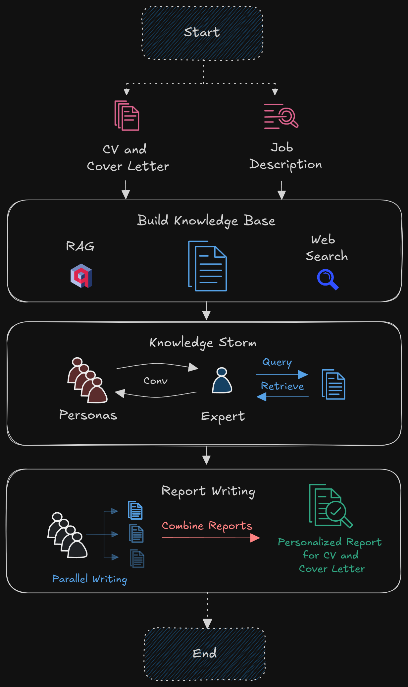

# Agent Ghost Writer

## Setup and Installation
1. Clone the repository:
   ```bash
   git clone https://github.com/ankithsavio/Agent-GhostWriter.git
   cd Agent-GhostWriter
   ```

2. Create a virtual environment and install dependencies:
   ```bash
   python -m venv venv
   source venv/bin/activate # On Windows use `venv\Scripts\activate`
   pip install -r requirements.txt
   ```

3. Configure API keys in a `.env` file:
   ```env
   PYTHONPATH=
   GEMINI_API_KEY=
   HF_TOKEN=
   HUGGINGFACEHUB_API_TOKEN=
   TOGETHER_API_KEY=
   MONGO_ROOT_USERNAME=
   MONGO_ROOT_PASSWORD=
   ```

## Dataflow Diagram


